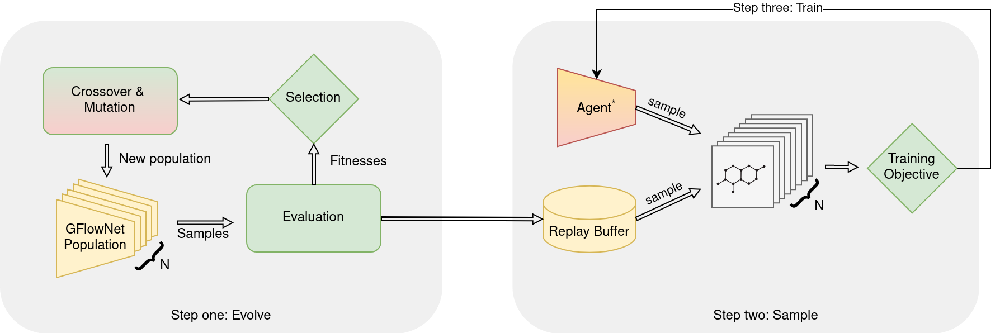

#  Evolution guided GFlowNets (EGFN)

This repository is based on [Distributional-GFlowNets](https://github.com/zdhNarsil/Distributional-GFlowNets).

  

PyTorch implementation for our paper

  

[Evolution guided generative flow networks]().

  

Anonymous authors.

  
  



  

We train our in two ways. Using evolutionary algorithms, we evolve a population of agent parameters to learn the optimal parameter population :robot::robot::robot: that maximize the reward signal. While evolution in the evolution step, the generated samples get stored in the prioritized replay buffer (PRB). Using the offline samples from the replay buffer and online samples from the current policy, we train a GFlowNets agent :robot: using gradient descent.

  

##  Setup

First, clone our repository.

```

cd ./E-GFN

```

Install [Anaconda](http://anaconda.org) environment in case not available. Run the following command next.

```

./setup.zsh

conda activate e-gfn

```

  

##  Hypergrid task

First, navigate to the directory.

```

cd ./grid

```

####  Examples to run the grid experiments

```

python run_hydra.py ndim=5 horizon=20 method=db_egfn n_train_steps=2500 replay_sample_size=16 seed=$seed R0=0.00001

```

####  Ablation studies

All ablations are in the `scripts` directory. To run long time horizon ablation, run

```

./scripts/sparsity.sh

```

Other ablations include-

```

./scripts/long_time_horizon.sh

./scripts/generalizability.sh

./scripts/ablation_population_size.sh

./scripts/gamma.sh

./scripts/ablation_elite_population.sh

./scripts/buffer_size.sh

```

To change the configurations for the experiment, simply change the `configs/main.yaml` file.

  
##  Antibody sequence task

First, navigate to the directory.

```

cd ./POAS

```

####  Examples to run the experiments

```

scripts/comparison.sh

```


##  hu4D5 CDR H3 design task

First, navigate to the directory.

```

cd ./HER

```

####  Examples to run the experiments

```

scripts/comparison.sh

```


##  Molecule task

First, navigate to the directory.

```

cd ./mols

```

Next change the `proxy_path` and `bpath` variable in the [gflownet.py](https://github.com/zarifikram/E-GFN/blob/main/mols/gflownet.py) file.

  

####  Running the experiments

To run the exeriment, run the following command.

```

python gflownet.py obj=fm_egfn sample_prob=0.2

```

To change the configurations for the experiment, simply change the `configs/main_gfn.yaml` file.


##  Citations

If you use the code for your research, please cite:

```
@article{
	ikram2024evolution,
	title={Evolution guided generative flow networks},
	author={Ikram, Zarif and Pan, Ling and Liu, Dianbo},
	journal={Transactions on Machine Learning Research},
	year={2025},
	url={https://openreview.net/forum?id=UgZIR6TF5N},
}
```
